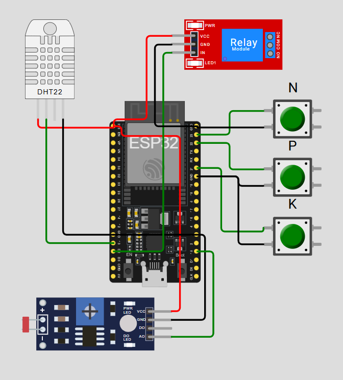
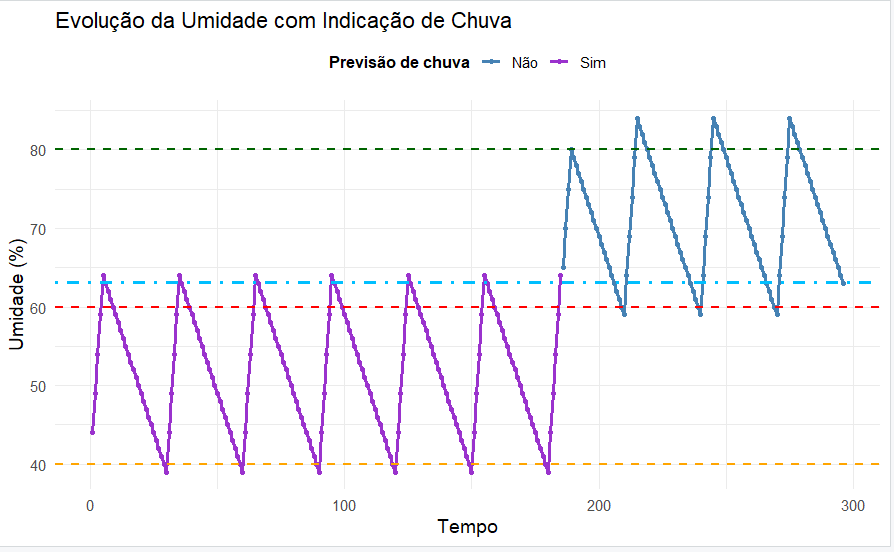

# 🌱 Sistema de Monitoramento e Irrigação Inteligente (FarmTech)

## 👥 Integrantes

- Paulo Martelli  
- Lucas Cariello Massena  
- Wanderlei Grizolli Junior  
- Fabio Mastaler  
- Raul Mauro Sarai de Jesus

## Introdução
A *FarmTech Solutions* continua seu desenvolvimento na Agricultura Digital, avançando para a **Fase 2** do projeto de gestão agrícola.  
Nesta etapa, o objetivo é **construir e simular um dispositivo eletrônico capaz de coletar dados em uma fazenda**, aplicando conceitos de IoT, automação e análise de dados.

O sistema deve ser capaz de **monitorar a umidade e o pH do solo (simulado)**, além dos **níveis de nutrientes N, P e K**, e **controlar automaticamente uma bomba de irrigação** para o cultivo de tomates, focando em manter a umidade entre 60 e 80, e também economizar recursos de água quando houver previsão de chuva utilizando a **API OpenWeather**.

---

## 🎯 Objetivo do Projeto
Desenvolver um **sistema de irrigação automatizado e inteligente** que monitore a umidade do solo em tempo real e controle a bomba de irrigação conforme os níveis de nutrientes (NPK), pH e previsão de chuva.

- Se **não houver previsão de chuva**:  
  - Liga a bomba se a umidade for **menor que 60%**.  
  - Desliga a bomba se a umidade for **maior ou igual a 80%**.

- Se **houver previsão de chuva**:  
  - Liga a bomba se a umidade for **menor que 40%**.  
  - Desliga a bomba se a umidade for **maior ou igual a 60%**.

> Essa lógica busca otimizar o uso de água, prevenindo irrigação desnecessária em dias chuvosos.
> A informação de previsão de chuva é obtida pelo programa em python utilizando a API da OpenWeather com localização de São Paulo.

---

## ⚙️ Componentes Utilizados
- **ESP32 DevKit V1**  
- **Sensor DHT22** → mede temperatura e umidade (simula a umidade do solo)  
- **Sensor LDR (Light Dependent Resistor)** → simula o sensor de pH  
- **3 Botões (N, P e K)** → simulam os níveis de nutrientes  
- **Módulo Relé (1 canal)** → controla a bomba de irrigação (LED representando bomba)  
- **Cabos e protoboard**  

---

## 🧩 Diagrama de Conexões

### Esquema Completo (ESP32 + Sensores)

---

## 🔌 Mapeamento de Pinos (ESP32 DevKit V1)

| Componente | Função | Pino ESP32 |
|-------------|--------|------------|
| Botão N | Nitrogênio | 23 |
| Botão P | Fósforo | 22 |
| Botão K | Potássio | 21 |
| DHT22 | Data | 13 |
| DHT22 | VCC | 3V3 |
| DHT22 | GND | GND |
| LDR | AO (analógico) | 15 |
| LDR | VCC | 3V3 |
| LDR | GND | GND |
| Relé | IN | 2 |
| Relé | VCC | 3V3 |
| Relé | GND | GND |

---

## 🧠 Lógica de Funcionamento
1. **Leitura dos Sensores**  
   - O **DHT22** mede a umidade e temperatura ambiente (simulando a umidade do solo).  
   - O **LDR** retorna um valor analógico que é interpretado como pH simulado.

2. **Leitura dos Botões (N, P e K)**  
   - Cada botão altera o valor do pH simulado, representando variações nos níveis de nutrientes.

3. **Controle da Bomba (Relé)**  
   - O sistema aciona ou desliga a bomba de acordo com a umidade e previsão de chuva.

4. **Faixa ideal de pH (para tomate)**  
   - Ideal: entre **6.0 e 6.8**.  
   - Fora dessa faixa: o sistema emite alerta no Serial Monitor.

5. **Exportação dos dados para análise**  
   - Dados (umidade, pH, previsão de chuva, estado da bomba) podem ser exportados como CSV via Serial para posterior análise em R.

---

## 📊 Análise Estatística em R
A análise em R foi utilizada para **avaliar a variação da umidade ao longo do tempo** e **visualizar os momentos em que há previsão de chuva**.
Foi anexado um arquivo de dados que foi exportado do programa em C por .csv para se fazer a analise

### Gráfico de Análise em R

